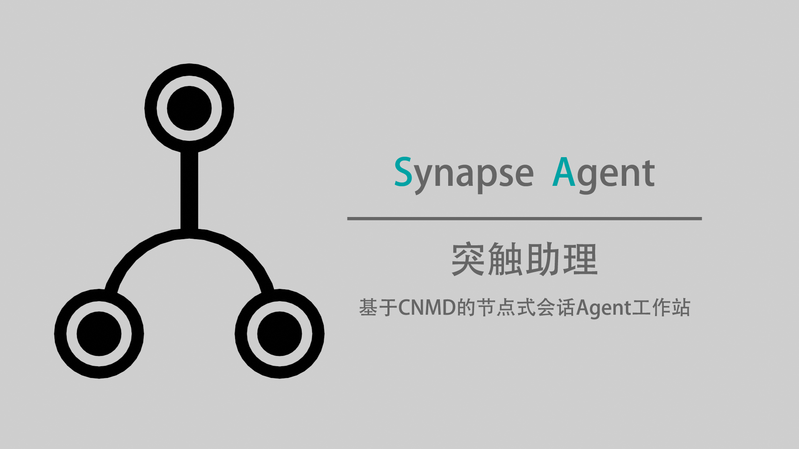

# SynapseAgent

> **Think Backward, And Re:Start!**



SynapseAgent 是一个**节点式对话管理**的 Agent 型 AI 助手，让 AI 不仅仅是聊天，而是真正能**操作文件、执行命令、访问网络**的工作伙伴。 

它借鉴 Git 分支思想，允许你在任意位置**保存、回退对话状态**，随时探索不同对话分支，再也不用担心对话走偏无法回头。

本项目为[CNMD-Agent](https://github.com/MichaelHyan/Cluster-Node-Manager-DataSystem)的改进版，使用相同的控制逻辑，针对CLI模式进行优化。

---

## ✨ 核心特性

- **🔗 节点式管理**：像 Git 一样保存、加载、回退对话状态，安全探索不同方向。
- **⚡ 事件驱动 Agent**：AI 可自主调用工具（文件、终端、网络）完成多步任务，而非仅仅回答问题。
- **📁 文件操作**：目录浏览、文件读写、删除等，直接操作工作目录。
- **💻 命令执行**：支持 CMD / PowerShell 命令，可执行系统任务。
- **🌐 网络访问**：内置网页抓取、Ping 检测，可获取网络信息。
- **🖼️ 多模态支持**：通过编码传递图片、音频、视频数据（依赖模型能力）。
- **🧠 记忆数据库**：持久化记忆，智能提取与检索，让 Agent 拥有长期记忆。
- **🧩 技能模块**：可扩展的 Skill 系统，Agent 可动态学习新技能。
- **🎭 提示词自定义**：灵活组合 persona、skills、extra 模块，打造专属 Agent。
- **📝 自动日志**：每次会话保存完整记录，方便回溯分析。
- **🔄 节点回溯**：支持按事件或轮数回退，精准控制对话走向。

---

## 📌 核心概念

### 节点（Node）

在每次 Agent 开始处理任务前，你可以将当前对话状态存档为一个“节点”。  
之后无论对话如何发展，你都可以随时加载之前的节点，从那里重新开始，就像 Git 分支一样。

```text
    #node save eventb
          ↓
eventA-eventB-eventC-eventD->...
(init)    |
          | -> #node load eventb
          |
       eventE->eventF->....
      (->eventB)
```

### 事件（Event）

你的输入 → Agent 可能调用工具 → 工具返回结果 → Agent 最终回答  
这一整个闭环称为一个事件。事件驱动模式下，Agent 会持续调用工具直到任务完成。

---

## 🚀 快速开始

### 1. 安装依赖

```bash
pip install -r requirements.txt
```

依赖项：
- `openai` — LLM API 调用
- `colorama` — 终端彩色输出

### 2. 配置

首次运行时将启动配置引导程序。根据引导填入信息，结束后将在本地保存`config.json`并启动程序。

你可以随时修改`config.json`。

```json
{
    "API_KEY": "sk-your-api-key",
    "BASE_URL": "https://api.deepseek.com/v1",
    "MODEL": "deepseek-v4-pro",
    "base_path": "你的工作目录路径",
    "lang": "zh_cn",
    "break": true,
    "cmd_check": false
}
```

| 配置项 | 说明 |
|--------|------|
| `API_KEY` | 你的 API 密钥（支持任何 OpenAI 兼容接口） |
| `BASE_URL` | API 基础 URL |
| `MODEL` | 模型名称 |
| `base_path` | Agent 操作文件的根目录，Agent 将视该目录为你的项目目录 |
| `lang` | 工具提示语言，支持 `zh_cn`、`en_us` 等 |
| `break` | 重复执行相同命令时是否中断任务（`true` 中断/`false` 拒绝但继续） |
| `cmd_check` | 系统命令是否需要用户确认（`true` 需要/`false` 不需要） |

> 如需调整模型参数（如 `temperature`），可修改 `config_model.json`（仅对支持该参数的模型生效）。

### 3. 启动

直接启动start.bat。

如果你有自定义的预设，则：

```bash
python SynapseAgent.py [预设名称]
```

你可以一次输入多行文字，输入结束后回车两次将信息发送给Agent。

---

## 🎛️ 用户控制命令

在对话中，你可以使用以 `#` 开头的命令：

| 命令 | 说明 |
|------|------|
| `#node save <名称>` | 保存当前对话状态到指定节点 |
| `#node load <名称>` | 从指定节点加载对话状态 |
| `#node list` | 列出所有已保存的节点 |
| `#node savef <名称>` | 将当前上下文和工具调用记录保存到本地文件 |
| `#node loadf <名称>` | 从本地文件载入对话状态 |
| `#node backward <轮数>` | 回退指定轮数的对话（默认1轮） |
| `#node backwardms` | 回退一次事件（回退到本次工具调用前） |
| `#mem save` | 提取当前对话关键信息并存入记忆数据库 |
| `#mem analyse` | 对记忆数据库进行整理、去重和压缩 |
| `#bot reset` | 清空对话记录 |
| `#bot reload` | 重新加载模型参数（API 热更新） |
| `#bot prompt <预设名>` | 切换系统提示词预设（需在 `prompt_loader/config.json` 中定义） |
| `#pause` | 强制暂停当前任务 |
| `#execute` | 确认命令 |
| `#help` | 显示帮助信息 |
| `#exit` | 退出程序 |

---

## 🧩 技能模块系统

`./skills/` 目录下存放了 Agent 可学习的技能文档。系统会根据需要自动查询。

**如何添加自定义技能？**
1. 在 `./skills/` 目录下创建一个新的 `.md` 文件。
2. 用清晰的自然语言描述该技能的用途、参数、步骤、期望返回格式。
3. Agent 即可在需要时读取并学习该技能。

> ⚠️ 技能文件应描述**技能的调用方式**，而不是存放对话记录或记忆内容。

---

## 🧠 系统提示词自定义

系统提示词由三个模块组成，均存放在 `prompt_loader/` 目录：
1. **persona**（基础人设）  
2. **skills**（基础能力，建议保留 `skill_base`）  
3. **extra**（额外规则）

### 配置步骤

1. 在 `prompt_loader/config.json` 中添加你的预设名称：

```json
"我的预设": {
    "persona": "my_persona",
    "skills": "skill_base",
    "extra": "none"
}
```

- 文件名为 `prompt_loader/persona/my_persona.md` 等。
- 若不需要某个模块，可以填 `"none"`。

2. 启动时指定预设：

```bash
python SynapseAgent.py 我的预设
```

也可以在对话中使用 `#bot prompt 我的预设` 动态切换。

---

## 🧰 自定义工具链

你可以为 Agent 添加新的工具。

1. 编写可调用的 Python 函数（或脚本），放置于 `tools/` 目录。
2. 在 `tool_handler.py` 中注册该工具，返回格式：
```json
{
    "sys": "给 LLM 的返回信息",
    "cli": "给用户的可见信息"
}
```
3. （可选）添加多语言支持：在 `lang/` 目录下添加对应语言键。
4. 通过技能文档或提示词，告知 Agent 该工具的调用方式。

---

## 🎭 记忆数据库

不同于普通的 `Memory.md`，记忆数据库具备独立的向量式存储，支持智能检索与关联。

- **存储**：`database/mem.json` 存放记忆键值，`database/relate.json` 存放关联关系。
- **检索**：Agent 在需要时可自动使用 `$mem` 关键词搜索记忆。
- **手动管理**：
  - `#mem save`  将当前对话关键信息写入记忆库
  - `#mem analyse`  整理压缩记忆库

---

## 📂 日志系统

每次会话自动保存日志于 `./logs/` 目录：
- `{时间戳}.json` — 完整对话记录
- `{时间戳}_node.json` — 节点状态快照
- `{时间戳}_tool.json` — 工具调用记录

---

## ⚠️ 注意事项

- 请务必在 `config.json` 中正确配置 API 信息和工作目录。
- Agent 对文件的操作是真实的，请提前备份重要数据。
- 如需启用多模态，确保所用模型支持图片/音频/视频信息的理解。
- 本系统使用自定义工具链，不依赖 OpenAI 的 `tool_calling` API。

---

## 📄 许可证

本项目采用 [Apache 2.0](LICENSE) 许可证。